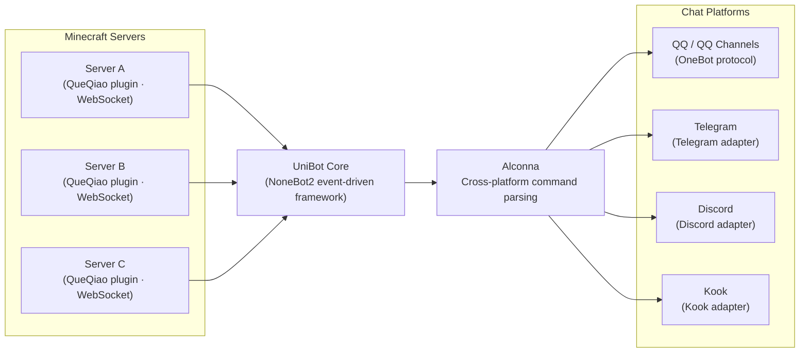

# Architecture

UniBot uses a **NoneBot2 event-driven** architecture, with the core framework separated from the extension system, keeping responsibilities clear.

## Overall Architecture

```file-tree
UniBot
├── nonebot2 core                 # Asynchronous event-driven framework
├── nonebot-adapter-minecraft     # Minecraft WebSocket communication
├── nonebot-plugin-alconna        # Cross-platform command parsing
├── nonebot-plugin-uninfo         # Unified session info
├── Plugins/
│   ├── Commands/                 # Built-in commands (declared as Command classes)
│   │   ├── Bot.py                # Bot management (about / check update / update / restart / superusers)
│   │   ├── Bound.py              # Whitelist binding
│   │   ├── Command.py            # Remote command execution
│   │   ├── Help.py               # Help system
│   │   ├── List.py               # Online player query
│   │   ├── Luck.py               # Daily fortune
│   │   ├── Send.py               # Message sending
│   │   └── Server.py             # Server status
│   └── Events.py                 # MC event processing hub
├── Scripts/
│   ├── Managers/
│   │   ├── Data.py               # Data persistence
│   │   ├── Server.py             # Server connection management
│   │   ├── WebUi.py              # Web UI static resource management
│   │   ├── Plugin.py             # Plugin management
│   │   └── Version.py            # Version management
│   ├── Extensions/               # Extension system framework
│   │   ├── Base.py               # Extension base class and metadata
│   │   ├── Command.py            # Command class system and CommandManager
│   │   ├── Service.py            # Service base class and ServiceRegistry
│   │   ├── Renderer.py           # Rendering engine, template, and resource orchestration
│   │   ├── Loader.py             # Extension discovery, ordering, and loading
│   │   └── Manager.py            # ExtensionManager singleton
│   ├── Api/                      # REST API routes
│   │   ├── Auth.py               # Login authentication (JWT / Cookie)
│   │   ├── Config.py             # Config management
│   │   ├── Players.py            # Player management
│   │   ├── Servers.py            # Server management
│   │   ├── Plugins.py            # Plugin management
│   │   ├── Extensions.py         # Extension management
│   │   ├── Logs.py               # Log viewing
│   │   ├── Status.py             # Status monitoring
│   │   ├── Users.py              # User management
│   │   ├── WebSocket.py          # WebSocket push
│   │   └── Schemas.py            # Data models and validation
│   ├── Config.py                 # Config model definitions
│   ├── Network.py                # Network request utilities
│   └── Utils.py                  # Utility functions
├── Extensions/                   # Extension packages (local / marketplace)
│   ├── Html2Pic/                 # Built-in rendering engine (default / fallback)
│   ├── Default/                  # Default template + resources combined package
│   └── ...
└── WebUi/                        # Vue 3 admin panel frontend
    ├── src/
    │   ├── views/                # Feature pages
    │   ├── stores/               # Pinia state management
    │   ├── router/               # Router configuration
    │   ├── utils/                # Utility functions
    │   └── composables/          # Composition API
    └── assets/                   # Static assets
```

## Communication Flow



## Core Mechanisms

### Event-Driven

The bot is based on NoneBot2's event-driven model. `Plugins/Events.py` acts as the event processing hub: it receives server events from the MC adapter (player join/leave, chat, death, etc.) and dispatches them to the corresponding sync logic.

### Manager Singletons

All managers use the **singleton pattern**, instantiated at the bottom of their files and exported uniformly through `Scripts/Managers/__init__.py`:

- `data_manager`: data persistence (players, servers, user data)
- `server_manager`: server connection management
- `plugin_manager`: plugin management
- `version_manager`: version management
- `webui_manager`: WebUI resource management
- `config_manager`: configuration management

### Dual-Entry Startup

- **`Bot.py`**: initializes NoneBot, registers adapters, loads plugins, loads extensions, builds commands, mounts the WebUI, then runs.
- **`Watchdog.py`**: a watchdog process that starts a `Bot.py` child process, monitors abnormal exits and restarts automatically, while also handling WebUI restart requests and dependency sync.

==`Watchdog.py` is recommended for daily use==: the bot restarts automatically after an abnormal exit, and it can also handle WebUI restart requests.

### Load Order

On startup, the bot completes initialization in the following order:

1. Initialize the config manager and register each platform's adapters.
2. Load NoneBot plugins (generic ecosystem plugins).
3. **Load extensions**: discover, validate, topologically sort, import and bind, register capabilities.
4. **Build commands**: uniformly validate and build all command matchers (built-in + extensions).
5. Run the NoneBot main loop.

Command building must be submitted in one pass after all command declarations are complete; if any command's definition, arguments, or handler fail validation, no partial matchers may be registered.

### Extension System

The extension system is UniBot's native capability framework, strictly separated from the NoneBot plugin system. Extensions have full access to internal capabilities (config, managers, rendering, and messaging utilities) and expose commands, services, rendering engines, templates, and resources to the framework through declarative registration. See [Extension System](/en/unibot/extension-system.html).

UniBot fully preserves the NoneBot2 ecosystem at its core: ready-made plugins from the NB Plugin Store integrate seamlessly and work alongside native extensions.

Core components:

- **Loader**: scans the `Extensions/` directory, parses manifests, builds the dependency graph and topologically sorts it, then imports and binds extension instances.
- **ExtensionManager**: the extension registry and state management (`enabled` / `disabled` / `blocked` / `failed`).
- **CommandManager**: collects command definitions uniformly, validates them, and builds Alconna matchers.
- **ServiceRegistry**: service registration and retrieval.
- **RendererManager**: the unified orchestration entry for rendering engines, templates, and resources.

### Image Rendering

The rendering system consists of three orthogonal layers: the rendering engine (renders pages into images), templates (provide layout), and resources (provide static materials). `RendererManager` is the sole orchestration entry, completing the full pipeline of "select template → inject config and resource functions → render the page → delegate to the rendering engine for the final image". See [Extension System](/en/unibot/extension-system.html#rendering-system).

### Data Persistence

Player, server, and user data is stored under the `Data/` directory in JSON format, managed through `data_manager`, UTF-8 encoded.

## Security Design

- JWT authentication: `access_token` (2h) and `refresh_token` (7d) are delivered via HttpOnly Cookies.
- `get_current_user` reads the Cookie first, falling back to the `Authorization: Bearer` Header.
- WebSocket authentication is carried automatically via Cookie.
- The frontend fetch enables `credentials: 'include'`.