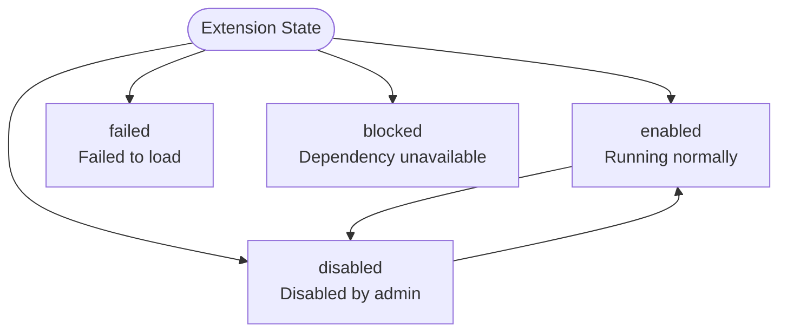

# Extension System

UniBot is built on the [NoneBot2](https://nonebot.dev/) ecosystem and can **seamlessly integrate with the NB Plugin Store** — community-ready NoneBot plugins work out of the box. At the same time, on top of the NoneBot plugin system, UniBot also provides a **native extension system** to carry features deeply bound to the bot's internal capabilities.

Extensions are independent units of bot functionality. They have full access to the bot's internal capabilities (config, managers, rendering, and messaging utilities) while being strictly isolated from core functionality and enabled/disabled on demand.

## Design Philosophy

The extension system follows these principles:

- **Ecosystem Compatibility**: built entirely on NoneBot2 at its core; plugins from the NB Plugin Store integrate seamlessly and work alongside native extensions.
- **Capability Layering**: extensions are divided into five categories by responsibility — commands, services, renderers, templates, and resources — each with its own role, avoiding mixed responsibilities.
- **Declarative Registration**: extensions describe their capabilities through a manifest and declarative registration; the framework handles discovery, validation, and assembly uniformly, so there is no need to worry about registration details.
- **Failure Isolation**: a single extension failing to load does not affect the overall operation of the bot, and the failure reason is recorded clearly and traceable.
- **Privilege Containment**: code extensions run in the same process as the bot and count as trusted code; resource extensions execute no code at all and only provide static content.

## Extension Types

Extensions come in three code types and two resource types:

::: table title="Extension Types Overview" copy="all"
| Type | Contains Code | Responsibility | Typical Use |
|------|-----------|------|---------|
| **Command extension** (`command`) | Yes | Add new chat commands, or override built-in command behavior | Query, stats, custom gameplay commands |
| **API extension** (`api`) | Yes | Provide reusable service capabilities for other extensions or the whole system | Weather queries, permission checks, data services |
| **Renderer extension** (`renderer`) | Yes | Render already-generated pages into images | html2pic, Playwright, wkhtmltoimage |
| **Template extension** (`template`) | No | Provide page templates and declare resource dependencies | Layouts and color schemes for lists, status cards |
| **Resources extension** (`resources`) | No | Provide static files such as images, fonts, and style fragments | Background images, fonts, color palettes |
:::

> **About combining**: `template` and `resources` are both code-free types and can be combined in the same extension package; `renderer` is a code capability and must be packaged independently. To publish code, templates, and resources together, split them into multiple extension packages and connect them explicitly through dependencies.

## Extension Package Forms

Extensions exist in three forms, all loaded in exactly the same way:

::: table title="Extension Package Forms" copy="all"
| Form | Description | Metadata Source |
|------|------|-----------|
| **Single-file extension** | Suited to simple commands; a single file is enough | Constructor arguments of the extension instance |
| **Directory extension** | A complete extension with multiple modules, configuration, and dependencies | `Extension.toml` manifest |
| **Marketplace extension** | Source packages downloaded from GitHub Releases | `Extension.toml` manifest |
:::

All extensions are stored uniformly under the `Extensions/` directory; the Loader does not distinguish between local and marketplace extensions.

### Directory Structure

```file-tree
Extensions/
├── Hello.py                # Single-file extension (optional)
├── WeatherExt/             # Directory extension (optional)
│   ├── Extension.toml      # Manifest (required)
│   ├── __init__.py         # Entry point (required for code extensions)
│   ├── Commands.py         # Command definitions (optional)
│   ├── Services.py         # Service definitions (optional)
│   └── ...                 # Other modules
└── Default/                # Code-free template + resources combined package
    ├── Extension.toml
    ├── Templates/          # Template root directory
    └── Resources/          # Resources root directory
```

Naming conventions:

- Extensions uniformly use PascalCase naming, such as `WeatherExt`.
- The directory name of a directory extension must match `extension.id` exactly (including case).
- The entry point of a code extension is fixed at `__init__.py`; code-free extensions do not need an entry file.

## Manifest (`Extension.toml`)

Directory extensions declare identity, compatibility, dependencies, and type information through the manifest. The manifest is strictly validated by the framework; unknown fields, invalid types, or invalid version constraints will directly block loading.

```toml
[manifest]
schema_version = 1               # Manifest format version

[extension]
id = "WeatherExt"                # Unique ID, PascalCase, matches the directory name
name = "示例扩展"                 # Display name
version = "1.0.0"
author = "xxx"
description = "扩展描述"
types = ["api"]                  # api | command | renderer | template | resources

[compatibility]
unibot = ">=0.0.5"               # Compatible bot version

[dependencies]
extensions = ["OtherExt"]        # Other extension IDs this depends on; determine load order
python = []                      # Third-party Python dependencies

[renderer]                       # Renderer extensions only
name = "html2pic"                # Renderer name

[template]                       # Template extensions only
entry = "Templates"              # Template root directory (relative to the extension package root)
resources = []                   # Optional resource extension IDs

[resources]                      # Resources extensions only
root = "Resources"               # Resources root directory (relative to the extension package root)
```

### Template Config Schema

Code-free templates can declare a restricted set of config fields in the manifest for customizing the template's appearance. Version 1 supports six types — `string`, `integer`, `number`, `boolean`, `color`, `select` — and every item must provide a type and a default value:

```toml
[template.config_schema.primary_color]
type = "color"
default = "#2f80ed"
title = "主色"

[template.config_schema.compact]
type = "boolean"
default = false
title = "紧凑布局"

[template.config_schema.font]
type = "select"
default = "default"
options = ["default", "serif", "mono"]
title = "字体"
```

- Field names must be valid identifiers and must not start with an underscore.
- `select` must provide a non-empty `options`, and the default value must be included in it.
- `title`, `description`, numeric `min`/`max`, and string `min_length`/`max_length` are optional display or constraint info.

## Configuration & Data Directories

Extension configuration and data are strictly separated from core configuration, each in its own place:

::: table title="Configuration & Data Directories" copy="all"
| Data | Location | Maintained By | Content |
|------|------|--------|------|
| Extension toggle | `Config/Extensions.toml` | User / WebUI | The `enabled` flag for each extension |
| Extension config | `Config/Extensions/<id>.toml` | User / WebUI | Validated business configuration |
| Management state | `Data/Extension/States.toml` | Framework | Source, version, checksum, install time, dependency ownership |
| Business data | `Data/Exs/<id>/` | Extension data utilities | Caches, databases, generated files |
:::

```toml
# Config/Extensions.toml —— users can directly edit the toggle
[WeatherExt]
enabled = true
```

```toml
# Config/Extensions/WeatherExt.toml —— extension business config
api_key = "xxx"
city = "Shanghai"
```

Design conventions:

- `Config.toml` stores only core UniBot configuration; extensions must not read or write it directly.
- Extension configuration and data are confined to their own directories; out-of-bounds access is rejected by the framework.
- Upgrading or uninstalling source keeps extension configuration and business data by default; complete deletion requires separate confirmation by an admin.
- Config writes use atomic replacement; when validation or disk writing fails, the old file is preserved.

## Extension States

Extension runtime states are managed uniformly by the framework, with clear meanings:

::: table title="Extension States" copy="all"
| State | Meaning |
|------|------|
| `enabled` | Running normally |
| `disabled` | Disabled by an admin, persisted after restart |
| `blocked` | A dependency was disabled or failed to load; currently unavailable |
| `failed` | The extension itself failed to load or failed its lifecycle |
:::



- Disabled extensions are not imported and register no capabilities; extensions that depend on them directly or indirectly are marked as `blocked`, while unrelated extensions are unaffected.
- Disabling does not delete the extension's source, configuration, or data; they continue to be used when re-enabled.
- `disabled` is persisted as the admin's deliberate choice; `failed` and `blocked` are recomputed on the next load.
- ==In the current version, enabling / disabling takes effect after restart.==

## Rendering System

The rendering system consists of three orthogonal layers with non-overlapping responsibilities:

| Layer | Responsibility | Example |
|------|------|------|
| **Rendering engine** (`renderer`) | Render already-generated pages into images | html2pic, Playwright |
| **Template** (`template`) | Provide the page layout and declare resource dependencies | List template, status card template |
| **Resources** (`resources`) | Provide static files such as images, fonts, and styles | Background images, fonts, color palettes |

- Rendering engines can be used independently; templates must have at least one template directory; resources can be reused by multiple templates.
- In the same rendering task, the template decides the appearance, resources provide the materials, and the rendering engine produces the final image; the three are coordinated through the framework.
- Templates may only load files from their own declared directories; out-of-bounds access is forbidden.
- Multiple template packages form a lookup chain by explicit priority: the currently selected template comes first, and the default template serves as the final fallback.

### Rendering Configuration

Rendering capabilities are configured in `Config.toml`:

```toml
[image]
mode = true
renderer = "html2pic"        # Rendering engine
template = "Default"         # Template package
```

- Switching templates takes effect immediately, with no restart needed.
- Switching rendering engines takes effect after restart; if the configured engine does not exist or is not selected, rendering will report an error.
- Resources extensions are determined by the template's explicit `resources` dependency; when missing or out-of-bounds, the corresponding template is marked unavailable.

## Loading & Dependency Management

### Load Order

After core initialization, the bot loads extensions in the following order:

1. Scan the `Extensions/` directory to identify single-file and directory extensions.
2. Parse manifests and metadata, uniformly validating IDs, types, version constraints, and compatibility.
3. Build the dependency graph and perform topological sorting, detecting missing and circular dependencies.
4. Import code extension entry points, obtain the unique extension instance, and complete binding.
5. Submit command, service, and renderer declarations; register templates and resources.
6. Execute lifecycle methods in topological order to start external resources.

By default, any extension failure does not block the bot from starting, but that extension and its dependents are marked unavailable, with the error reason provided to logs and the WebUI.

### Dependency Rules

- Extensions declare dependencies on other extensions via `[dependencies].extensions`; the depended-upon extension starts before its dependents.
- The third-party Python dependencies declared by extensions are aggregated by the framework and installed uniformly; they are removed on uninstall only when no other extension uses them.
- Circular dependencies are detected and block the loading of the related extensions.

## WebUI Management

The WebUI provides complete extension management capabilities (admin permission required):

| Feature | Description |
|------|------|
| Extension list | View installed extensions' types, versions, dependencies, and enable/disable states |
| Enable / Disable | Persist the enable/disable intent; takes effect after restart |
| Config management | Visually edit extension config through forms generated from the manifest / models |
| Rendering settings | Select the current rendering engine and template separately; template switches take effect immediately |
| Extension marketplace | Browse, install, and uninstall marketplace extensions (future version) |

## More

- For the full developer guide, see [Developing Plugins](/en/unibot/developing-extensions.html).
- For extension-related WebUI API endpoints, see [REST API](/en/unibot/api-reference.html).