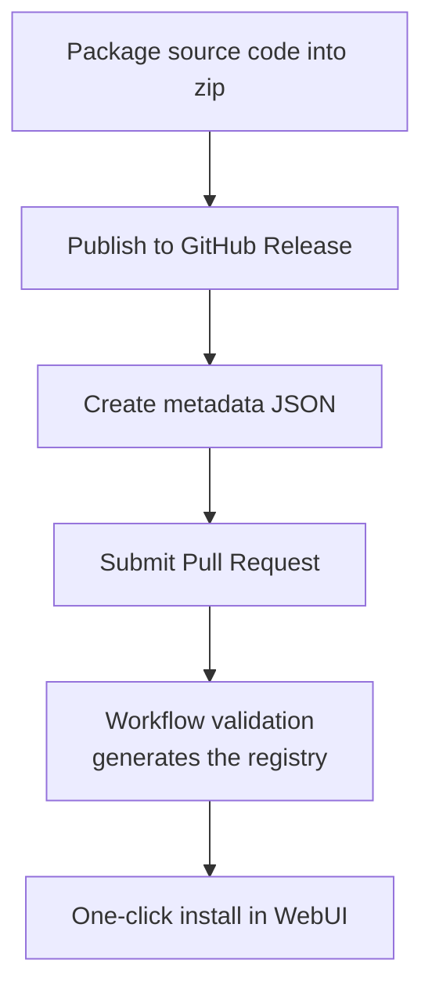

# Publishing to the Marketplace

The extension marketplace is maintained in the [UniBot.Market](https://github.com/MineJPGcraft/UniBot.Market) repository.
The repository holds a registry `extensions.json` **that is automatically read by the bot**; users submit their
extensions via **Pull Request**, and the bot can then search and one-click install them from the WebUI.

## Overall Flow

Publishing a marketplace extension consists of three steps:



::: steps

1. **Package the extension**

   Compress the extension source code into a zip, making sure the **root directory contains `Extension.toml`**, see [1. Package the Extension](#_1-package-the-extension).

2. **Publish a Release**

   Upload the zip as an asset to the extension repository's GitHub Release, see [2. Publish a Release](#_2-publish-a-release).

3. **Register metadata**

   Register the metadata in the marketplace's `extensions/<id>.json` and submit a PR, see [3. Create Metadata](#_3-create-metadata).

4. **Merge into the registry**

   After the workflow validation passes and the PR is merged, `extensions.json` is generated automatically and the bot can discover your extension.

:::

## 1. Package the Extension

> [!TIP]
> **It is recommended to use the [`Extensions/Example`](https://github.com/MineJPGcraft/Minecraft_UniBot/tree/main/Extensions/Example)
> template directly**: it already ships with a complete packaging workflow (`.github/workflows/release.yml`) that
> automatically packages the extension into a zip and publishes it to GitHub Release when a tag is pushed, so no
> manual configuration is needed. Just develop your own extension on top of the template.

Extensions are distributed as source zips (not via PyPI), and the zip root **must** contain `Extension.toml`. Refer to
the packaging workflow of
[`Extensions/Example`](https://github.com/MineJPGcraft/Minecraft_UniBot/blob/main/Extensions/Example/.github/workflows/release.yml);
the zip structure should be:

```file-tree
xxx-1.0.0.zip
├── Extension.toml      # Manifest (must be at the root)
├── __init__.py         # Entry point (required for code extensions)
├── Commands.py         # Command definitions (optional)
├── Services.py         # Service definitions (optional)
└── ...
```

> [!IMPORTANT]
> The zip root must be the extension content itself; it must **not** contain an extra nested `Extension/` directory.
> Otherwise UniBot cannot find the `Extension.toml` at the root after extraction, and the installation fails.

## 2. Publish a Release

Upload the packaged zip to the extension repository's GitHub Release. It is recommended to name the asset `<id>-<version>.zip`
(for example `Placeholder-1.0.0.zip`) so the registry script can identify it automatically.

## 3. Create Metadata

Create `<extension-id>.json` (for example `Example.json`) under the marketplace's `extensions/` directory:

```json
{
  "id": "Example",
  "name": "Example Extension",
  "repo": "MineJPGcraft/Example",
  "description": "An example extension that demonstrates the UniBot extension development workflow.",
  "official": false
}
```

### Field Reference

::: table title="Metadata Fields" copy="all" hl-rows="tip:2,3"
| Field | Required | Description |
|------|------|------|
| `id` | Yes | The extension's unique identifier; must be alphanumeric with underscores and must match the `id` in the `Extension.toml` inside the package |
| `name` | Yes | Display name |
| `repo` | Yes | The extension's source repository, in `owner/repo` format |
| `description` | No | Extension description |
| `official` | No | Whether it is an official release (boolean, default `false`); reviewed and set by repository maintainers, third-party extensions cannot declare it themselves |
:::

> [!NOTE]
> Metadata files starting with an underscore (e.g. `_EXAMPLE.json`) are skipped by the build script and used as documentation templates.

## 4. Submit a PR

Submit the new metadata file to the [UniBot.Market](https://github.com/MineJPGcraft/UniBot.Market)
repository and create a Pull Request:

- The workflow automatically **validates the metadata format** on the PR and pulls Releases from your extension repository to verify it can be built.
- After validation passes, the repository maintainer merges it, and `extensions.json` is generated automatically.

## SHA-256 Security Mechanism

> **Why is sha256 not required?**

The SHA-256 checksum is **computed at build time by the marketplace repository's workflow** to prevent download
tampering. User-submitted metadata does **not contain and does not accept** a `sha256` field, which guarantees
security. When installing through the WebUI, the downloaded zip is verified against the SHA-256 provided by the
registry, and ==installations are rejected if the checksum fails==.

## Automatic Updates

- **On PR / push**: `build.yml` rebuilds the registry and fetches the latest Release assets for each extension,
  recomputing the SHA-256 checksums.
- **Every day at 9:00 / 15:00 / 21:00 (Beijing time)**: `update.yml` automatically checks each extension repository
  for new Releases, updates the version numbers and SHA-256 checksums, and commits the changes back to `main`.

## Installation Flow (Triggered from WebUI)

::: steps

1. **Download**

   Select a version from the registry and download the Release asset zip.

2. **Verify**

   Verify the SHA-256 checksum provided by the registry.

3. **Security check**

   Verify that the zip root matches the `id` in the manifest; reject absolute paths, `../` paths and symbolic links.

4. **Atomic replacement**

   Extract to a temporary directory; after all checks pass, atomically replace `Extensions/<id>/`.

5. **Restart to take effect**

   Takes effect after restart.

:::

Installation is a **rollback-able transaction**: download, verification, extraction, and manifest validation all
happen in a temporary directory, and a failure at any step must not change the current version. Upgrading downloads the
new version and atomically replaces the directory; uninstalling deletes the directory (both done in the WebUI).

## Local Build (Optional)

You can build against an existing Release without a GitHub Token (the public API is rate-limited); requires Python 3.11+:

```bash
python3 scripts/build_registry.py
```

Strict validation mode (equivalent to the PR check):

```bash
python3 scripts/build_registry.py --validate
```
