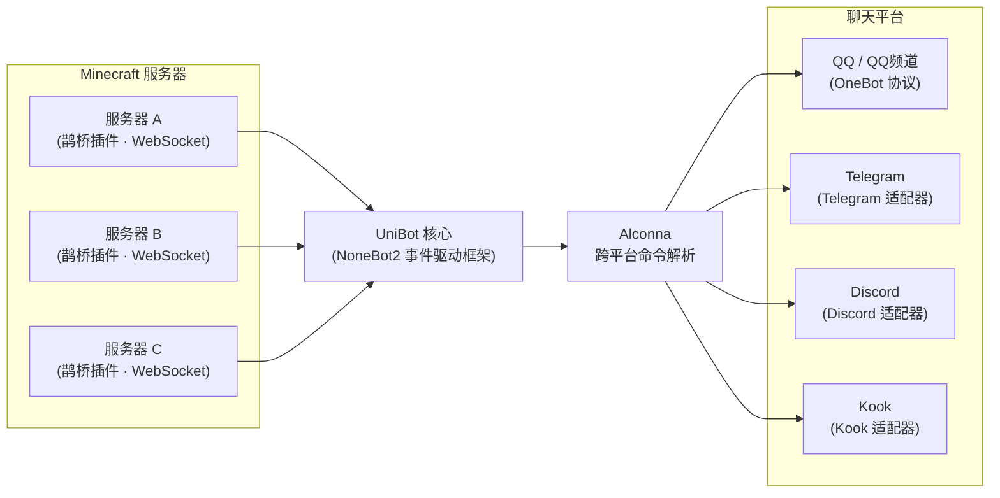

# 架构设计

UniBot 采用 **NoneBot2 事件驱动** 架构，核心框架与扩展体系分离，职责清晰。

## 整体架构

```file-tree
UniBot
├── nonebot2 核心                  # 异步事件驱动框架
├── nonebot-adapter-minecraft     # Minecraft WebSocket 通信
├── nonebot-plugin-alconna        # 跨平台命令解析
├── nonebot-plugin-uninfo         # 统一会话信息
├── Plugins/
│   ├── Commands/                 # 内置指令（Command 类声明）
│   │   ├── Bot.py                # 机器人管理（关于/检查更新/更新/重启/超级用户）
│   │   ├── Bound.py              # 白名单绑定
│   │   ├── Command.py            # 远程指令执行
│   │   ├── Help.py               # 帮助系统
│   │   ├── List.py               # 在线玩家查询
│   │   ├── Luck.py               # 每日运势
│   │   ├── Send.py               # 消息发送
│   │   └── Server.py             # 服务器状态
│   └── Events.py                 # MC 事件处理中枢
├── Scripts/
│   ├── Managers/
│   │   ├── Data.py               # 数据持久化
│   │   ├── Server.py             # 服务器连接管理
│   │   ├── WebUi.py              # Web UI 静态资源管理
│   │   ├── Plugin.py             # 插件管理
│   │   └── Version.py            # 版本管理
│   ├── Extensions/               # 扩展系统框架
│   │   ├── Base.py               # Extension 基类与元数据
│   │   ├── Command.py            # 命令类体系与 CommandManager
│   │   ├── Service.py            # Service 基类与 ServiceRegistry
│   │   ├── Renderer.py           # 渲染引擎、模板与资源编排
│   │   ├── Loader.py             # 扩展发现、排序与加载
│   │   └── Manager.py            # ExtensionManager 单例
│   ├── Api/                      # REST API 路由
│   │   ├── Auth.py               # 登录认证（JWT / Cookie）
│   │   ├── Config.py             # 配置管理
│   │   ├── Players.py            # 玩家管理
│   │   ├── Servers.py            # 服务器管理
│   │   ├── Plugins.py            # 插件管理
│   │   ├── Extensions.py         # 扩展管理
│   │   ├── Logs.py               # 日志查看
│   │   ├── Status.py             # 状态监控
│   │   ├── Users.py              # 用户管理
│   │   ├── WebSocket.py          # WebSocket 推送
│   │   └── Schemas.py            # 数据模型与校验
│   ├── Config.py                 # 配置模型定义
│   ├── Network.py                # 网络请求工具
│   └── Utils.py                  # 工具函数
├── Extensions/                   # 扩展包（本地 / 市场）
│   ├── Html2Pic/                 # 渲染引擎扩展（随官方市场分发）
│   ├── Default/                  # 默认模板 + 资源组合包
│   └── ...
└── WebUi/                        # Vue 3 管理面板前端
    ├── src/
    │   ├── views/                # 各功能页面
    │   ├── stores/               # Pinia 状态管理
    │   ├── router/               # 路由配置
    │   ├── utils/                # 工具函数
    │   └── composables/          # 组合式 API
    └── assets/                   # 静态资源
```

## 通信流程



## 核心机制

### 事件驱动

机器人基于 NoneBot2 的事件驱动模型。`Plugins/Events.py` 作为事件处理中枢，接收来自 MC 适配器的服务器事件（玩家加入/离开、聊天、死亡等），并分发到对应的同步逻辑。

### 管理器单例

所有管理器采用 **单例模式**，在文件底部实例化，通过 `Scripts/Managers/__init__.py` 统一导出：

- `data_manager`：数据持久化（玩家、服务器、用户数据）
- `server_manager`：服务器连接管理
- `plugin_manager`：插件管理
- `version_manager`：版本管理
- `webui_manager`：WebUI 资源管理
- `config_manager`：配置管理

### 双入口启动

- **`Bot.py`**：初始化 NoneBot、注册适配器、加载插件、加载扩展、构建指令、挂载 WebUI，然后运行。
- **`Watchdog.py`**：守护进程，启动 `Bot.py` 子进程，监控异常退出并自动重启，同时处理 WebUI 重启请求与依赖同步。

==日常使用推荐 `Watchdog.py`==：机器人异常退出会自动重启，还能处理 WebUI 的重启请求。

### 加载时序

机器人在启动时按以下顺序完成初始化：

1. 初始化配置管理器，注册各平台适配器。
2. 加载 NoneBot 插件（通用生态插件）。
3. **加载扩展**：发现、校验、拓扑排序、导入绑定、注册能力。
4. **构建指令**：统一校验并构建全部指令匹配器（内置 + 扩展）。
5. 运行 NoneBot 主循环。

指令构建必须在全部指令声明完成后一次性提交；任一指令定义、参数或处理器校验失败时，不得注册部分匹配器。

### 扩展系统

扩展系统是 UniBot 的原生能力框架，与 NoneBot 插件体系严格分离。扩展可以完整访问内部能力（配置、管理器、渲染与消息工具），并通过声明式注册向框架暴露指令、服务、渲染引擎、模板与资源。详见 [扩展系统](/unibot/extension-system.html)。

UniBot 底层完整保留 NoneBot2 生态：NB 插件商店中的现成插件可无缝接入，与原生扩展协同工作。

核心组件：

- **Loader**：扫描 `Extensions/` 目录，解析清单，建立依赖图并拓扑排序，导入并绑定扩展实例。
- **ExtensionManager**：扩展注册表与状态管理（`enabled` / `disabled` / `blocked` / `failed`）。
- **CommandManager**：统一收集指令定义，校验后构建 Alconna 匹配器。
- **ServiceRegistry**：服务注册与获取。
- **RendererManager**：渲染引擎、模板与资源的统一编排入口。

### 图片渲染

渲染系统由三个正交层次构成：渲染引擎（将页面渲染为图片）、模板（提供版式）与资源（提供静态素材）。`RendererManager` 作为唯一编排入口，完成「选择模板 → 注入配置与资源函数 → 渲染页面 → 委托渲染引擎成图」的完整流程，详见 [扩展系统](/unibot/extension-system.html#渲染系统)。

### 数据持久化

`Data/` 目录下以 JSON 格式存储玩家、服务器、用户数据，通过 `data_manager` 管理，UTF-8 编码。

## 安全设计

- JWT 认证：`access_token`（2h）与 `refresh_token`（7d）通过 HttpOnly Cookie 下发。
- `get_current_user` 优先读取 Cookie，fallback 到 `Authorization: Bearer` Header。
- WebSocket 认证通过 Cookie 自动携带。
- 前端 fetch 启用 `credentials: 'include'`。