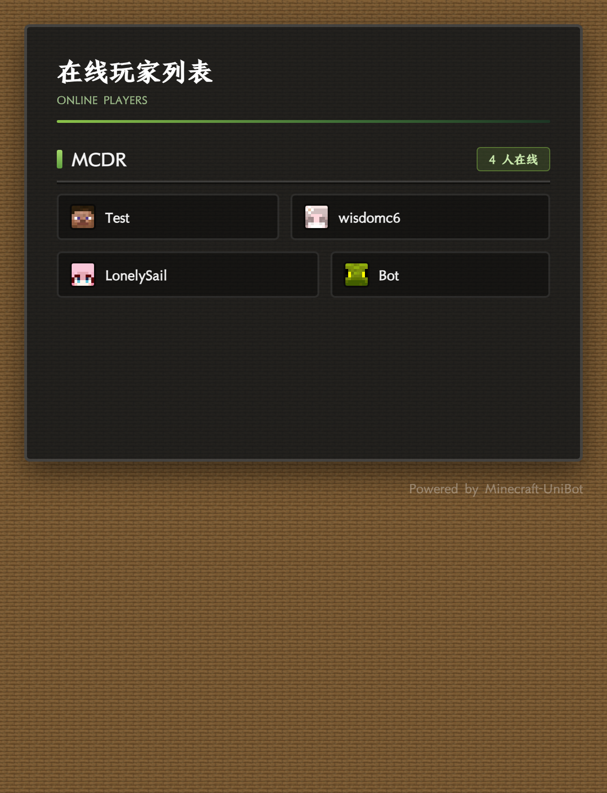
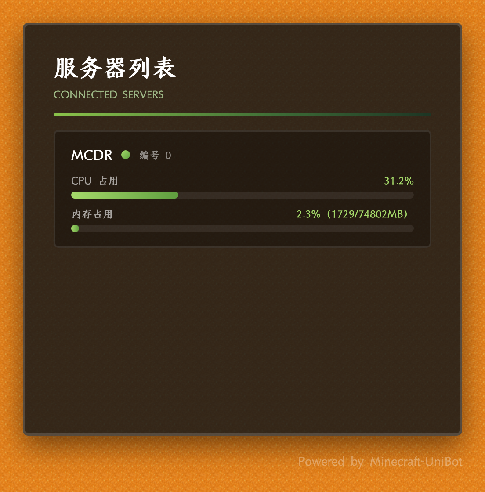
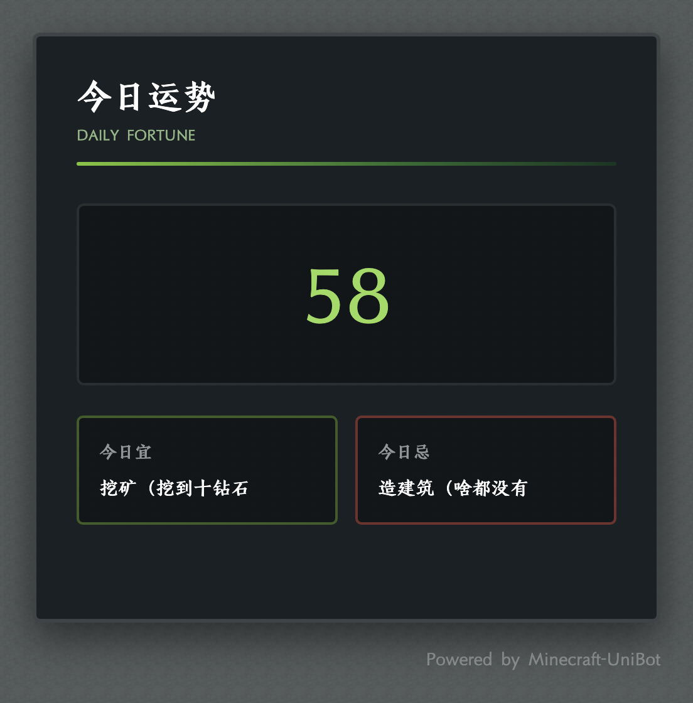
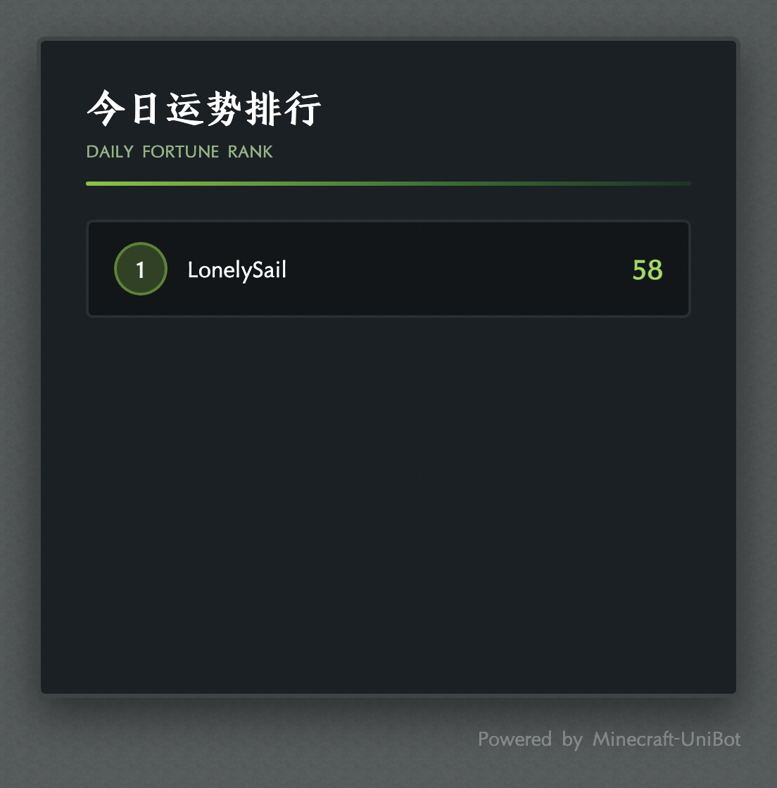
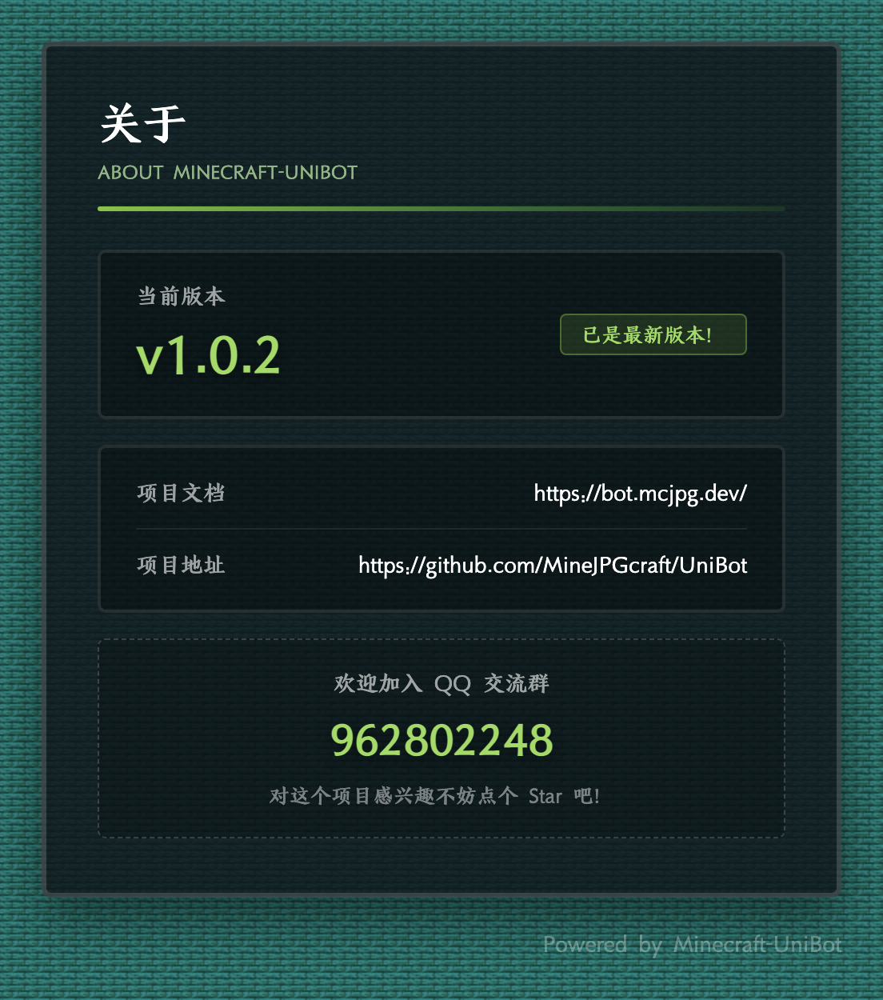
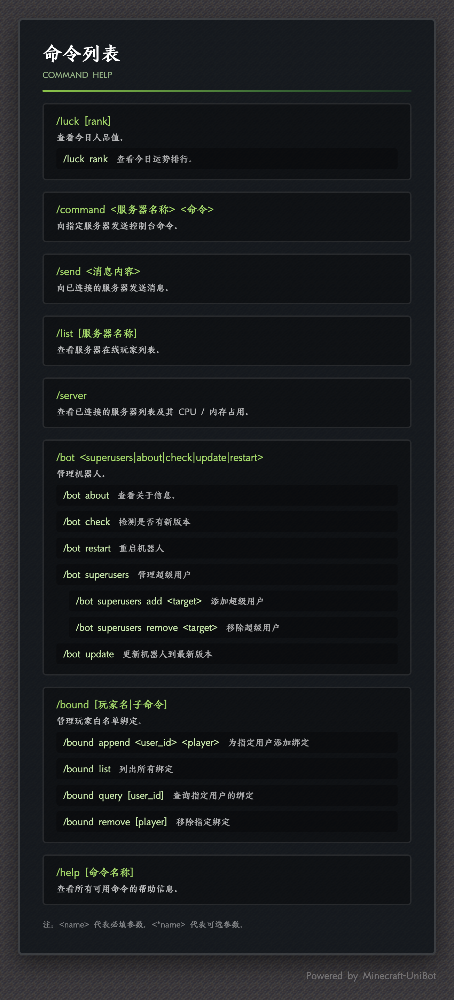
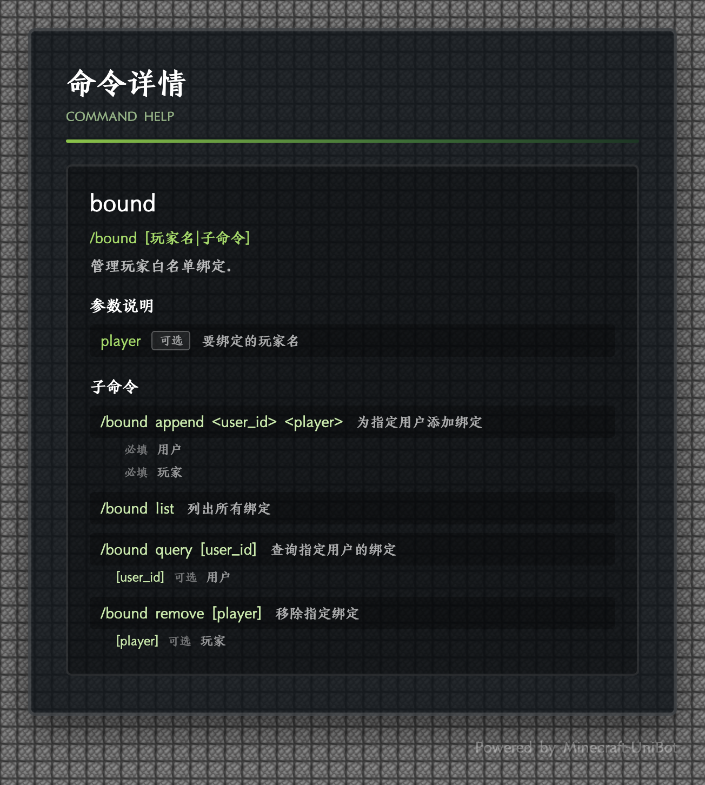

  

  
  
  
  
  

<h1 align="center">Minecraft UniBot</h1>

  <b>跨平台 · 多服互联 · 即插即用 — 让 Minecraft 与你的聊天世界无缝相连</b>

  <a href="https://bot.mcjpg.dev/">📚 项目文档</a>
  ·
  <a href="https://qm.qq.com/q/B3kmvJl2xO">💬 加入 QQ 群</a>
  ·
  <a href="https://github.com/MineJPGcraft/UniBot/issues">🐛 反馈问题</a>

  <b><i>Cross-platform · Multi-server interconnection · Plug-and-play — Seamlessly bridging Minecraft with your chat world.</i></b>

  <a href="https://bot.mcjpg.dev/en">📚 <i>Docs</i></a>
  ·
  <a href="https://qm.qq.com/q/B3kmvJl2xO">💬 <i>Contact us</i></a>
  ·
  <a href="https://github.com/MineJPGcraft/UniBot/issues">🐛 <i>Report Issues</i></a>

---

## 简介

**Minecraft UniBot** 是一套基于 [NoneBot2](https://nonebot.dev/) 构建的跨平台 Minecraft 机器人，通过 [鹊桥](https://github.com/17TheWord/QueQiao) 协议与服务器互通，让 Minecraft 与你的聊天世界无缝相连。

- **真正的跨平台**：不止 QQ，还支持 Telegram、Discord、Kook、QQ 频道等，一套指令全平台通用
- **多服互联**：同时连接多台 Minecraft 服务器，消息互通，跨服聊天零延迟
- **全服务端兼容**：支持 Fabric、Forge、Spigot、Paper 等主流服务端，甚至是基岩版服务器，即插即用
- **扩展系统**：指令、服务、渲染引擎、模板与资源五类扩展，即插即用，失败自动隔离
- **WebUI 管理面板**：现代化管理界面，可视化配置、实时监控、日志查看，开箱即用
- **图片渲染模式**：将指令输出渲染为精美图片，支持自定义背景

### *Introduction*

<i>

**Minecraft UniBot** is a cross-platform chat bot built on [NoneBot2](https://nonebot.dev/). It connects to Minecraft servers via the [QueQiao](https://github.com/17TheWord/QueQiao) protocol, seamlessly bridging Minecraft with your chat world.

- **Truly cross‑platform** – Not just QQ, but also Telegram, Discord, Kook, QQ Guilds, and more – a single set of commands works everywhere.
- **Multi‑server interconnection** – Connect to multiple Minecraft servers at the same time, with zero‑latency messaging between them.
- **Full server compatibility** – Supports all major server types, including Fabric, Forge, Spigot, Paper, and even Bedrock editions – plug and play.
- **Extension system** – Five kinds of extensions: commands, services, rendering engines, templates, and resources. All are plug‑and‑play, with automatic isolation if any fails.
- **WebUI management panel** – A modern admin interface featuring visual configuration, real‑time monitoring, and log viewing – ready out of the box.
- **Image rendering mode** – Renders command outputs as beautifully styled images, with full support for custom backgrounds.

</i>

## 📸 效果展示

### 🖥️ WebUI 管理面板

| 仪表盘 | 服务器管理 |
|---|---|
| 

 | 

 |

| 配置中心 | 适配器管理 |
|---|---|
| 

 | 

 |

| 插件管理 | 扩展管理 |
|---|---|
| 

 | 

 |

| 插件市场 | 日志查看 |
|---|---|
| 

 | 

 |

| 连接聊天平台 | 令牌授权 |
|---|---|
| 

 | 

 |

### 🎨 指令图片渲染

指令输出渲染为精美图片，支持玩家头像与自定义背景：

| `/list` 指令 | `/server` 指令 | `/luck` 指令 |
|---|---|---|
| 

 | 

 | 

 |

| `/luck rank` 指令 | `/bot about` 指令 | `/help` 指令 | `/help <命令名>` 指令（命令详情） |
|---|---|---|---|
| 

 | 

 | 

 | 

 |

## 快速开始

完整的安装、配置与使用说明请参阅 **[项目文档](https://bot.mcjpg.dev/)**：

- [快速开始](https://bot.mcjpg.dev/guide/快速开始.html) — 安装与启动
- [功能特性](https://bot.mcjpg.dev/guide/功能特性.html) — 功能一览
- [指令手册](https://bot.mcjpg.dev/guide/指令手册.html) — 指令说明
- [配置说明](https://bot.mcjpg.dev/unibot/配置说明.html) — 配置文件详解
- [MC 接入](https://bot.mcjpg.dev/adapter/) — 服务器端接入方式

## 许可证

本项目采用 **GPL-3.0** 许可证。修改后的代码必须开源并注明出处，**禁止商用**。详见 [LICENSE](./LICENSE)。

## 致谢

- [NoneBot2](https://nonebot.dev/) — 高效优雅的异步机器人框架
- [nonebot-adapter-minecraft](https://github.com/17TheWord/nonebot-adapter-minecraft) — Minecraft 协议适配
- [Alconna](https://github.com/ArcletProject/Alconna) — 强大的命令解析库

---

  Made with ❤️ by LonelySail

